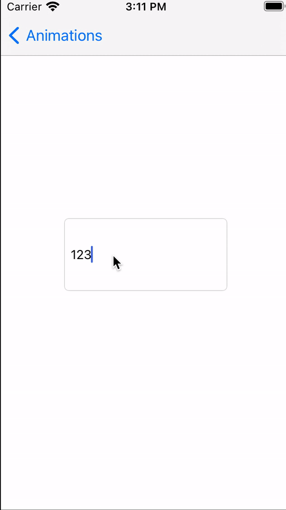
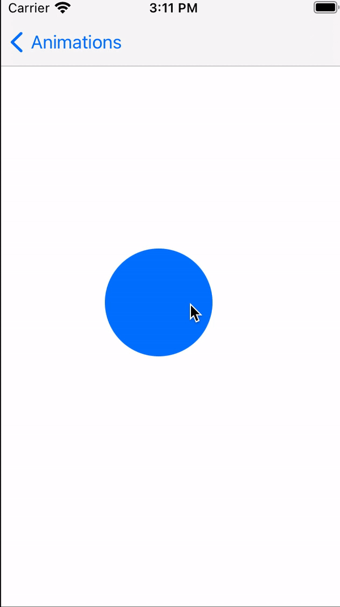
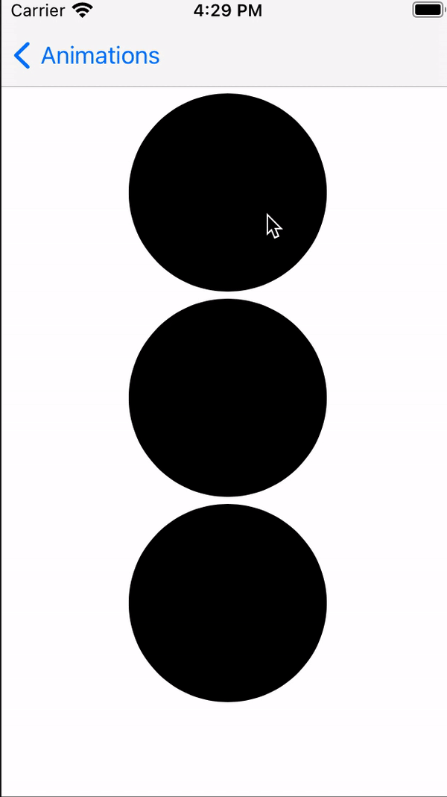

# CoreAnimationDemo

iOS core animation demo.

## Pulsator

Implimented with CAReplicatorLayer and CABasicAnimation.

## Emitter

Implemented with CAEmitterLayer.

## Wave

Implemented with CAShapeLayer, CAGradientLayer and CADisplayLink.

## Shaking Text Field

Implemented with CABasicAnimation and UITextFieldDelegate .

## Pulsating View on Tap

Implemented with CAAnimationGroup, CAKeyframeAnimation and CABasicAnimation.

## Circle Progress

Implemented with UIBezierPath, CABasicAnimation, and CountingLabel.

